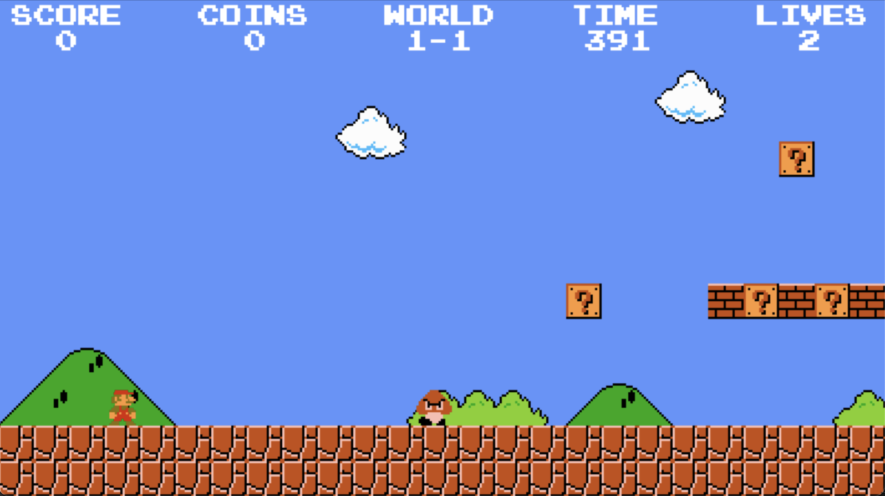

<div align="center">
  <h1>🍄 SuperMarioVision</h1>
  <p><strong>Un Controller IA Multimodale per Giochi Platform 2D in Tempo Reale</strong></p>
  <p>Gioca a Super Mario Bros usando solo la tua Webcam e il tuo Microfono.</p>

  

  
  
  
  
</div>

## 📖 Panoramica
**SuperMarioVision** è un progetto sviluppato per il corso di AI-LAB che esplora le Interfacce Utente Naturali (NUI) in ambienti di gioco altamente reattivi. I sistemi tradizionali di riconoscimento dei gesti soffrono di un grave *input lag* dovuto al sovraccarico cognitivo e computazionale dei classificatori di Machine Learning (il problema del "Pose-and-Wait").

Per risolvere questo limite, abbiamo sviluppato un'**Architettura Multimodale Ibrida** che disaccoppia completamente il tracciamento spaziale dai comandi per le azioni istantanee, offrendo un'esperienza di gioco a latenza zero.

## 🧠 L'Architettura Ibrida
Il problema di controllo è stato scomposto in tre canali visivi paralleli e un canale acustico:

### 1. Tracciamento delle Zone Spaziali (Machine Learning)
- **Cosa fa:** Controlla il movimento orizzontale continuo (Sinistra, Centro, Destra).
- **Come funziona:** Utilizza una **Support Vector Machine (SVM)** altamente ottimizzata e addestrata su un dataset personalizzato di 6300 pose corporee normalizzate. Ha raggiunto un'accuratezza offline del 100%.
- **Fail-safe:** Se la confidenza del modello ML scende, subentra un sistema di fallback geometrico deterministico (che traccia la coordinata del naso) per garantire un gioco ininterrotto.

### 2. Rilevamento Fisico del Salto (Euristiche a Latenza Zero)
- **Cosa fa:** Rileva il salto fisico del giocatore per far saltare Mario nel gioco.
- **Come funziona:** Bypassa completamente il Machine Learning. Applica euristiche geometriche direttamente alle derivate temporali grezze dei landmark delle spalle estratti da MediaPipe. Calcolando il $\Delta y$ verticale su un buffer circolare di 10 frame, il sistema innesca il salto istantaneamente non appena viene superata una certa soglia di velocità.

### 3. Rilevamento dello Sprint (Euristiche Edge-Detection)
- **Cosa fa:** Controlla la velocità di corsa di Mario.
- **Come funziona:** Valuta la distanza relativa tra il polso e la spalla. Un rilevatore di "fronte di salita" (rising-edge) fa in modo che alzando il braccio venga inviato un singolo impulso `SPRINT`, e abbassandolo venga inviato un impulso `WALK`, eliminando lo spamming dei comandi.

### 4. Comandi Vocali (Vosk)
- **Cosa fa:** Gestisce stati discreti del gioco (Pausa, Fuoco, Riprendi).
- **Come funziona:** Viene eseguito in modo asincrono in un thread parallelo. Vincolando il `KaldiRecognizer` a un vocabolario strettamente limitato (*"pausa", "fuoco", "spara"*), il sistema raggiunge una percentuale di successo dell'80% anche in ambienti con forte rumore di sottofondo.

## 🛠️ Elaborazione dei Segnali (Filtro di Kalman)
Per mitigare l'intrinseco tremolio spaziale (jitter) delle fotocamere RGB monoculari, l'output grezzo di MediaPipe non viene utilizzato direttamente. Al contrario, istanziamo dinamicamente **99 Filtri di Kalman scalari indipendenti** (uno per ogni coordinata $x, y, z$ dei 33 landmark corporei). Questo sistema smussa perfettamente i dati della traiettoria senza introdurre il ritardo tipico delle semplici medie mobili.

---

## 🚀 Installazione e Avvio

1. **Clona il repository:**
   ```bash
   git clone https://github.com/RomoloDef/SuperMarioVision.git
   cd SuperMarioVision
   ```

2. **Installa le dipendenze:**
   Assicurati di avere Python installato, poi esegui:
   ```bash
   pip install -r requirements.txt
   ```

3. **Avvia il gioco:**
   Puoi avviare il gioco direttamente usando il Makefile:
   ```bash
   make run
   ```
   *Oppure manualmente tramite Python:*
   ```bash
   python Game/main.py
   ```

## 📁 Struttura delle Directory
* `CV_controller/`: Contiene la logica principale dell'IA.
  * `vision.py`: Il loop video principale e l'implementazione dell'Architettura Ibrida.
  * `gestures.py`: Le euristiche geometriche a latenza zero (Salto, Sprint).
  * `signal_filters.py`: L'implementazione del Filtro di Kalman.
  * `train_classifier.py`: Lo script per addestrare i modelli SVM/MLP.
  * `voice_controller.py`: Il modulo di riconoscimento vocale Vosk.
* `Game/`: Contiene l'implementazione personalizzata di Super Mario Bros e il game loop.
* `testing_models/`: Script diagnostici (`test_scaler.py`, `test_voice.py`) per isolare e testare i singoli componenti.

## 🎓 Autori
Sviluppato per il corso **AI-LAB (Computer Vision, Signal Processing, and NLP)** presso Sapienza Università di Roma da:
- **Matteo Geusa**
- **Romolo Deffereria**
